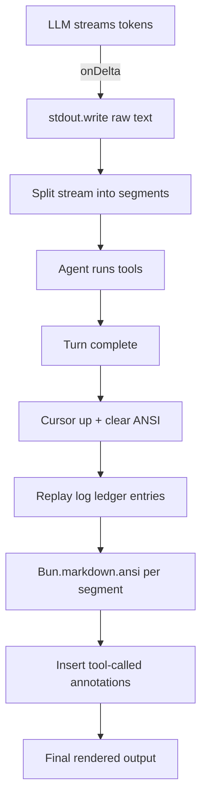

# Agent Cody

A harness to learn about harnesses...

An interactive CLI agent harness built with Bun, TypeScript, and OpenAI-compatible APIs. Designed as a learning project to explore agent architectures, tool use, and structured telemetry.

## Overview

Agent Cody is a command-line AI agent that helps with software engineering tasks. is a command-line AI agent that helps with software engineering tasks. It interacts with users through a readline prompt, calls tools on their behalf (file operations, searching, and task context management), and tracks session statistics including token usage, tool call success rates, and response durations.

### Key Features

- **Interactive REPL**: Readline-based prompt loop with graceful exit on empty input
- **Tool Calling**: Automatic multi-turn tool execution (up to 50 iterations per turn)
- **Built-in Tools**:
  - `ls` — List directory contents with hidden file visibility controls
  - `read_file` — Read text files with line offsets, truncation handling, and binary detection
  - `simple_grep` — Regex search across files with configurable context lines
  - `edit_file` — Apply batched atomic edits (edit/insert/delete/replace) to text files; all ops validated before mutation
  - `files` — Batch create (max 5) or delete (max 2) files; parent dirs created recursively; each path validated against workspace root
  - `goals` — Initialize the current goal and ordered action steps
  - `state` — Update live task notes, decisions, completed steps, and files read
  - `bash_exec` — Execute shell commands with workspace path guards, Bubblewrap sandboxing by default, optional host execution, bounded timeouts, and capped output
- **File Path Guards**: All file operations validate paths against workspace root (`agent/tools/fs_guard.ts`) to prevent directory traversal via `..` or symlinks
- **Structured Logging**: JSON logging via Pino with OpenTelemetry-compliant attributes
- **Session Statistics**: Real-time tracking of tool calls, success/failure rates, token usage, and latency
- **Rate Limit Handling**: Graceful degradation on 429/503 responses
- **Strict Type Safety**: Full TypeScript with strict mode, Zod schemas for all boundaries
- **Automatic Context Compaction**: Maintains long-running sessions within a 1,050,000-token context budget using scheduled rubric checks every 20 tool-call rounds and forced summarization above 80% usage; preserves the task request and live task state while removing stale transcript and tool-action history

## Architecture

The codebase follows a layered architecture with unidirectional dependencies:

```
main.ts (entry)
    ↓
agent/ (orchestration layer)
    ├── loop.ts       — Agent loop: prompts, dispatches tools, tracks stats
    ├── types.ts      — AgentContext, ToolDefinition, ToolResult, TurnHooks
    ├── prompt/      — System prompt and live task context snapshots
        ├── prompt.ts
        └── rubrik.ts
    ├── util.ts       — Wire-format conversion (ToolDefinition → ChatCompletionTool)
    ├── stats.ts      — SessionStats tracking and recording
    └── tools/        — Built-in tool implementations
        ├── ls.ts
        ├── read_file.ts
        ├── edit_file.ts
        ├── grep.ts
        ├── file.ts
        └── context/     — Goal/state tools and automatic transcript compaction
llm/ (transport layer)
    ├── client.ts     — LLMClient: transforms messages to OpenAI API format
    ├── types.ts      — ConfigSchema, OpenAICompatConfig, LLMRequest
config/ (infrastructure)
    ├── env.ts        — Environment config (NVIDIA NIM API)
    └── logger.ts     — Pino logger with OTel formatting
schemas/messages.ts     — Message types (Role, Messages, ToolCall)
```

### Design Principles

- **Agent → LLM unidirectionality**: The agent layer constructs `LLMRequest` objects; the LLM layer never imports from agent
- **Schema-driven boundaries**: All I/O uses Zod schemas for runtime validation
- **Tool abstraction**: Tools define their own Zod parameters and an `execute` function; the loop handles dispatch and error handling uniformly
- **Turn hooks**: `TurnHooks` exposes streaming, tool-call, usage, step-completion, and turn-end events without coupling the agent loop to presentation
- **Context compaction**: The agent estimates prompt and transcript tokens after tool rounds. Every 20 tool-call rounds it asks a rubric model whether to `CONTINUE` or `COMPRESS`; when compression is selected, a summary replaces the old transcript while preserving the task request, goal, action steps, notes, decisions, current step, and files read. If estimated usage exceeds 80% of the 1,050,000-token budget, compaction is forced; summaries use a shorter prompt when usage is above 90%. Internal rubric and summary requests are temporary and their usage is tracked separately.
- **Live task context**: Goals and action steps are initialized when assigned, while state, decisions, notes, and file tracking are updated as work progresses

## Getting Started

### Prerequisites

- [Bun](https://bun.sh/) runtime
- An NVIDIA API key (or compatible OpenAI API endpoint)

### Installation

```bash
bun install
```

### Configuration

Set the following environment variables (copy `.env.example` to `.env` and fill in your credential):

```bash
export API_KEY=your_api_key_here
export BASE_URL=https://integrate.api.nvidia.com/v1
export MODEL=z-ai/glm-5.2
```

### Running

```bash
bun run start
# or
NODE_ENV=dev bun run main.ts
```

You'll see a prompt: `### Prompt:` — type your query and press Enter.

## Development

### Available Scripts

| Script            | Description                                      |
|-------------------|--------------------------------------------------|
| `bun run start`   | Start the agent (sets NODE_ENV=dev)              |
| `bun run typecheck` | Type check without emitting files             |
| `bun run format`  | Format code with Biome                           |
| `bun run format:check` | Check formatting without changes           |
| `bun run lint`    | Lint code with Biome                              |
| `bun run lint:fix` | Auto-fix lint issues                            |

### Code Style

- **Formatter**: Biome (2-space indent, double quotes, LF line endings, trailing commas)
- **Import style**: Use explicit ES module imports with `.js` extensions
- **No comments**: Unless explicitly requested
- **Strict TypeScript**: `strict`, `noUncheckedIndexedAccess`, `exactOptionalPropertyTypes`, `verbatimModuleSyntax`

### Agent Turns and Context

`Agent.turn()` accepts optional `TurnHooks` callbacks for streamed deltas, tool-call start and result events, usage updates, completed action steps, and turn completion. The loop initializes the conversation with the eight registered tools: `ls`, `read_file`, `simple_grep`, `edit_file`, `files`, `goals`, `state`, and `bash_exec`.

Live task context is kept alongside conversation messages. The `goals` tool initializes the current goal and ordered action steps; the `state` tool records notes, decisions, completed steps, and files read. The current context snapshot is added to each request system prompt, and successful context updates are applied after tool execution.

Context compaction runs automatically after tool-call rounds and requires no user action. The thresholds are defined in `agent/constants.ts`: `CONTEXT_BUDGET_TOKENS` is `1_050_000`, scheduled checks run every `COMPACTION_TURN_THRESHOLD` (`20`) rounds, forced compaction starts above 80% of the budget, and `COMPACTION_NEAR_LIMIT_RATIO` (`0.9`) selects the shorter summary prompt near the limit. `TurnHooks.onCompactionStart` and `onCompactionApplied` expose compaction status and the generated summary to the CLI; failures leave the existing context intact and execution continues.

### Adding a New Tool

1. Create `agent/tools/my_tool.ts`
2. Define a Zod schema for parameters
3. Export a `ToolDefinition` with `name`, `description`, `label`, `parameters`, and `execute`
4. Register it in `agent/loop.ts` in the `available_tools` array
5. If the tool changes task context, return a validated `contextUpdate`
6. Run `bun run lint:fix` and `bun run typecheck`

## Telemetry
All logging is structured JSON via Pino, with OpenTelemetry-compatible fields:

- `service.name`, `service.version`, `environment` — standard OTel resource attributes
- `trace.id`, `span.id`, `trace.flags` — trace context (when OTel is configured)
- `severityNumber`, `severityText` — OTel log severity mapping
- `pino-pretty` is used for human-readable dev output

## Terminal Rendering

This project intentionally avoids a full Text User Interface (TUI) library. Instead, it streams text straight to `process.stdout` and uses ANSI escape sequences to overlay rich content interactively. The orchestration lives in `agent/loop.ts`, the details in `config/logger.ts`.

### Streaming and text render

1. **Raw stream**: As the LLM streams tokens, each delta is written to `stdout` immediately via `process.stdout.write(text)` (`agent/loop.ts`). This gives the user a latency-free view.
2. **Segmentation**: The stream is split on newlines into segments, so each text block can later be rendered as Markdown separately (`loop.ts`).
3. **Markdown rendering with `Bun.markdown.ansi`**: Once the model turn completes, each segment text is passed through `Bun.markdown.ansi(seg)`, which converts GitHub-flavored Markdown into colored ANSI output directly in the terminal without any external TUI library.
4. **Tool-call annotations**: If any tools ran between two text segments (tracked via a boundary ledger), an interpolated `[tools were called]` line is inserted under the rendered Markdown block.

### The log ledger and redraw trick

Logs (“pino-pretty” structured, colorful json lines) and the streamed answer share `stdout`. With no TUI double-buffering, the loop needs to reconcile them visually:

- **`logLedger`** (`config/logger.ts`): every chunk written by the pino-pretty stream is appended here as `{lines: number, text: string}` lines. Lines are computed by `visualLines(text)`, which strips ANSI SGR codes and divides visible width by terminal column count to get the true row footprint.
- **Redraw sequence** (`agent/loop.ts`): after the turn completes:
  1. Calculate how far up the cursor needs to move (block lines from ledger + visual lines of streamed text).
  2. Emit `\x1b[<n>A` (cursor up) + `\x1b[J` (clear to end of screen).
  3. Reprint the `>` prompt marker, followed by each ledger entry (tool logs).
  4. Reprint the streamed text, but now rendered through `Bun.markdown.ansi`, with tool-call annotations in between.
- **Safety**: if the computed jump exceeds the terminal height (`process.stdout.rows ?? 24`), the redraw is skipped and output just advances normally.

### Rendering flow summary




- [x] `files` — batch create/delete files (max 5 / 2); each path validated against the workspace root
- [x] `edit_file` — modify files in-place with batched atomic edits (edit/insert/delete/replace)
- [x] `goals` — initialize the current goal and ordered action steps
- [x] `state` — update live task notes, decisions, completed steps, and files read
- [x] `bash_exec` — execute shell commands in a Bubblewrap sandbox by default, with bounded timeouts and capped output
- [ ] `filediff` — visual diffs between file versions
- [ ] `websearch` — search the web
- [ ] `webfetch` — fetch content from URLs

## License

See [LICENSE](LICENSE) for details.
