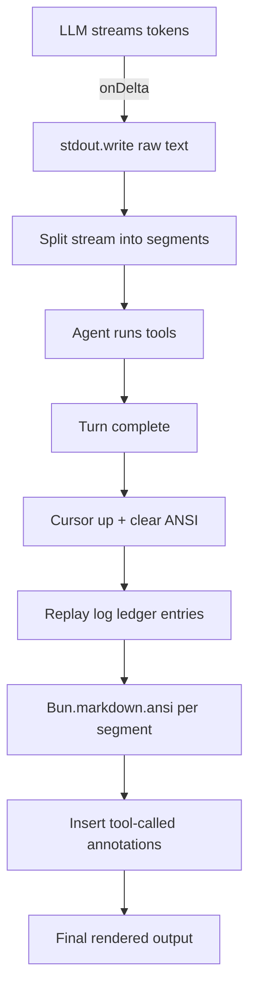

# Agent Cody Banks

A harness to learn about harnesses...

An interactive CLI agent harness built with Bun, TypeScript, and OpenAI-compatible APIs. Designed as a learning project to explore agent architectures, tool use, and structured telemetry.

## Overview

Agent Cody Banks is a command-line AI agent that helps with software engineering tasks. It interacts with users through a readline prompt, calls tools on their behalf (file listing, reading, searching), and tracks session statistics including token usage, tool call success rates, and response durations.

### Key Features

- **Interactive REPL**: Readline-based prompt loop with graceful exit on empty input
- **Tool Calling**: Automatic multi-turn tool execution (up to 50 iterations per turn)
- **Built-in Tools**:
  - `ls` — List directory contents with hidden file visibility controls
  - `read_file` — Read text files with line offsets, truncation handling, and binary detection
  - `edit_file` — Apply batched atomic edits (edit/insert/delete/replace) to text files; all ops validated before mutation
  - `files` — Batch create (max 5) or delete (max 2) files; parent dirs created recursively; each path validated against workspace root
  - `simple_grep` — Regex search across files with configurable context lines
- **File Path Guards**: All file operations validate paths against workspace root (`agent/tools/fs_guard.ts`) to prevent directory traversal via `..` or symlinks
- **Structured Logging**: JSON logging via Pino with OpenTelemetry-compliant attributes
- **Session Statistics**: Real-time tracking of tool calls, success/failure rates, token usage, and latency
- **Rate Limit Handling**: Graceful degradation on 429/503 responses
- **Strict Type Safety**: Full TypeScript with strict mode, Zod schemas for all boundaries

## Architecture

The codebase follows a layered architecture with unidirectional dependencies:

```
main.ts (entry)
    ↓
agent/ (orchestration layer)
    ├── loop.ts       — Agent loop: prompts, dispatches tools, tracks stats
    ├── types.ts      — AgentContext, ToolDefinition, ToolResult
    ├── prompt.ts     — System prompt defining Agent Cody's behavior
    ├── util.ts       — Wire-format conversion (ToolDefinition → ChatCompletionTool)
    ├── stats.ts      — SessionStats tracking and recording
    └── tools/        — Built-in tool implementations
        ├── ls.ts
        ├── read_file.ts
        ├── edit_file.ts
        ├── grep.ts
        ├── file.ts
        └── bash_exec.ts   ← stub

llm/ (transport layer)
    ├── client.ts     — LLMClient: transforms messages to OpenAI API format
    ├── types.ts      — ConfigSchema, OpenAICompatConfig, LLMRequest
config/ (infrastructure)
    ├── env.ts        — Environment config (NVIDIA NIM API)
    └── logger.ts     — Pino logger with OTel formatting
schemas/messages.ts     — Message types (Role, Messages, ToolCall)
```

### Design Principles

- **Agent → LLM unidirectionality**: The agent layer constructs `LLMRequest` objects; the LLM layer never imports from agent
- **Schema-driven boundaries**: All I/O uses Zod schemas for runtime validation
- **Tool abstraction**: Tools define their own Zod parameters and an `execute` function; the loop handles dispatch and error handling uniformly

## Getting Started

### Prerequisites

- [Bun](https://bun.sh/) runtime
- An NVIDIA API key (or compatible OpenAI API endpoint)

### Installation

```bash
bun install
```

### Configuration

Set the following environment variables (copy `.env.example` to `.env` and fill in your credential):

```bash
export API_KEY=your_api_key_here
export BASE_URL=https://integrate.api.nvidia.com/v1
export MODEL=z-ai/glm-5.2
```

### Running

```bash
bun run start
# or
NODE_ENV=dev bun run main.ts
```

You'll see a prompt: `### Prompt:` — type your query and press Enter.

## Development

### Available Scripts

| Script            | Description                                      |
|-------------------|--------------------------------------------------|
| `bun run start`   | Start the agent (sets NODE_ENV=dev)              |
| `bun run typecheck` | Type check without emitting files             |
| `bun run format`  | Format code with Biome                           |
| `bun run format:check` | Check formatting without changes           |
| `bun run lint`    | Lint code with Biome                              |
| `bun run lint:fix` | Auto-fix lint issues                            |

### Code Style

- **Formatter**: Biome (2-space indent, double quotes, LF line endings, trailing commas)
- **Import style**: Use explicit ES module imports with `.js` extensions
- **No comments**: Unless explicitly requested
- **Strict TypeScript**: `strict`, `noUncheckedIndexedAccess`, `exactOptionalPropertyTypes`, `verbatimModuleSyntax`

### Adding a New Tool

1. Create `agent/tools/my_tool.ts`
2. Define a Zod schema for parameters
3. Export a `ToolDefinition` with `name`, `description`, `label`, `parameters`, and `execute`
4. Register it in `agent/loop.ts` in the `available_tools` array
5. Run `bun run lint:fix` and `bun run typecheck`

## Telemetry
All logging is structured JSON via Pino, with OpenTelemetry-compatible fields:

- `service.name`, `service.version`, `environment` — standard OTel resource attributes
- `trace.id`, `span.id`, `trace.flags` — trace context (when OTel is configured)
- `severityNumber`, `severityText` — OTel log severity mapping
- `pino-pretty` is used for human-readable dev output

## Terminal Rendering

This project intentionally avoids a full Text User Interface (TUI) library. Instead, it streams text straight to `process.stdout` and uses ANSI escape sequences to overlay rich content interactively. The orchestration lives in `agent/loop.ts`, the details in `config/logger.ts`.

### Streaming and text render

1. **Raw stream**: As the LLM streams tokens, each delta is written to `stdout` immediately via `process.stdout.write(text)` (`agent/loop.ts`). This gives the user a latency-free view.
2. **Segmentation**: The stream is split on newlines into segments, so each text block can later be rendered as Markdown separately (`loop.ts`).
3. **Markdown rendering with `Bun.markdown.ansi`**: Once the model turn completes, each segment text is passed through `Bun.markdown.ansi(seg)`, which converts GitHub-flavored Markdown into colored ANSI output directly in the terminal without any external TUI library.
4. **Tool-call annotations**: If any tools ran between two text segments (tracked via a boundary ledger), an interpolated `[tools were called]` line is inserted under the rendered Markdown block.

### The log ledger and redraw trick

Logs (“pino-pretty” structured, colorful json lines) and the streamed answer share `stdout`. With no TUI double-buffering, the loop needs to reconcile them visually:

- **`logLedger`** (`config/logger.ts`): every chunk written by the pino-pretty stream is appended here as `{lines: number, text: string}` lines. Lines are computed by `visualLines(text)`, which strips ANSI SGR codes and divides visible width by terminal column count to get the true row footprint.
- **Redraw sequence** (`agent/loop.ts`): after the turn completes:
  1. Calculate how far up the cursor needs to move (block lines from ledger + visual lines of streamed text).
  2. Emit `\x1b[<n>A` (cursor up) + `\x1b[J` (clear to end of screen).
  3. Reprint the `>` prompt marker, followed by each ledger entry (tool logs).
  4. Reprint the streamed text, but now rendered through `Bun.markdown.ansi`, with tool-call annotations in between.
- **Safety**: if the computed jump exceeds the terminal height (`process.stdout.rows ?? 24`), the redraw is skipped and output just advances normally.

### Rendering flow summary




- [x] `files` — batch create/delete files (max 5 / 2); each path validated against the workspace root
- [x] `writefile` — create/overwrite files with contents (not just empty)
- [x] `edit_file` — modify files in-place with batched atomic edits (edit/insert/delete/replace)
- [ ] `filediff` — visual diffs between file versions
- [ ] `bash_exec` — shell command execution (validation/sandbox TBD)
- [ ] `websearch` — search the web
- [ ] `webfetch` — fetch content from URLs

## License

See [LICENSE](LICENSE) for details.
