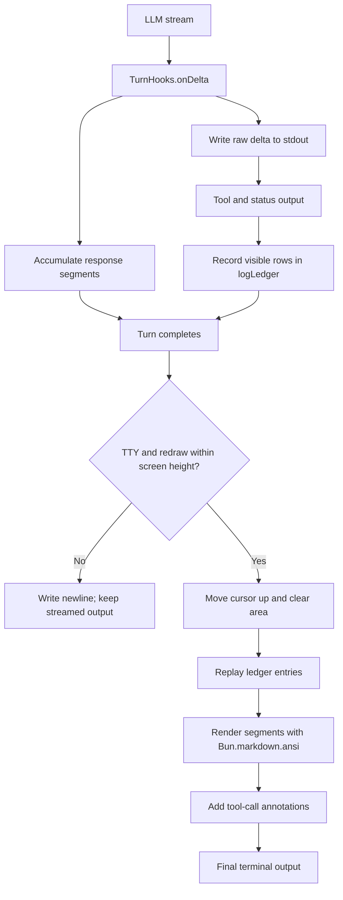

# Agent Cody


A harness to learn about harnesses...

A learning-oriented interactive CLI agent harness built with Bun, TypeScript, and OpenAI-compatible APIs. It explores agent orchestration, tool use, structured telemetry, and context management.

## Features

- Interactive readline-style CLI for software-engineering tasks
- Multi-turn tool execution, with up to 100 tool iterations per turn
- Eight built-in tools: `ls`, `read_file`, `simple_grep`, `edit_file`, `files`, `goals`, `state`, and `bash_exec`
- Workspace path guards for file operations
- Atomic, schema-validated file edits and Zod validation at I/O boundaries
- Structured Pino logging with OpenTelemetry-compatible fields
- Session statistics for tool calls, token usage, and latency
- Graceful handling of rate-limit (`429`) and service-unavailable (`503`) responses
- Automatic context compaction within a 1,050,000-token budget

## Requirements

- [Bun](https://bun.sh/)
- An API key for an OpenAI-compatible provider

## Installation

```bash
bun install
```

## Configuration

Copy the example file and set your credentials:

```bash
cp .env.example .env
```

| Variable | Required | Description | Default |
| --- | --- | --- | --- |
| `API_KEY` | Yes | API credential for the configured provider | — |
| `BASE_URL` | No | OpenAI-compatible API base URL | `https://api.openai.com/v1` |
| `MODEL` | No | Model name sent to the provider | `gpt-5.6-luna` |
| `REASONING_EFFORT` | No | Reasoning effort supported by the provider | `medium` |
| `COMPACTION_TURN_THRESHOLD` | No | Number of tool-call rounds between scheduled compaction checks during builds | `25` |

Example:

```dotenv
API_KEY=your-api-key
BASE_URL=https://api.openai.com/v1
MODEL=gpt-5.6-luna
REASONING_EFFORT=medium
COMPACTION_TURN_THRESHOLD=25
```

`COMPACTION_TURN_THRESHOLD` is injected into the compiled build. The value in `.env.example` is illustrative; the build defaults to `25` when the variable is not set.

## Running

Run the development CLI:

```bash
bun run start
```

Build and run the production executable:

```bash
bun run build
./build/cody
```

The CLI prompt is `cody>`. Type `exit` to quit.

## Architecture

The project is organized into layers:

```text
main.ts                 Entry point
agent/                  Agent orchestration and tools
  agent.ts              Turn execution and context compaction
  loop.ts               CLI loop and tool registration
  prompt/               System prompt and rubric logic
  stats.ts              Session statistics
  tools/                Built-in tool implementations
llm/                    OpenAI-compatible transport
config/                 Environment and logging configuration
schemas/                Runtime message schemas
build.ts                Production build script
```

The agent layer creates LLM requests, while the LLM layer remains independent of agent implementation details. Tools provide their own Zod parameter schemas and execution functions. `TurnHooks` exposes streaming, tool-call, usage, compaction, and turn-completion events to the CLI.

### Context compaction

The agent uses a strategy inspired by the [Self-Compact](https://arxiv.org/abs/2510.00609): after tool-call rounds it periodically asks the model whether history should be compressed, while forcing compaction above 80% of the 1,050,000-token budget. The summary preserves the original task and live task context—goals, steps, notes, decisions, and files read—then replaces older transcript messages so work can continue from the current step. Above 90% usage, a shorter summary prompt is used; failed compaction leaves the existing context intact.

## Development

### Scripts

| Script | Description |
| --- | --- |
| `bun run start` | Start the development CLI |
| `bun run build` | Build the compiled executable at `build/cody` |
| `bun run typecheck` | Type-check without emitting files |
| `bun run lint` | Run Biome linting |
| `bun run lint:fix` | Apply Biome lint fixes |
| `bun run format` | Format files with Biome |
| `bun run format:check` | Check formatting without modifying files |
| `bun run check` | Run typecheck, lint, and format checks |

### Adding a tool

1. Create a module under `agent/tools/`.
2. Define a Zod schema for its parameters.
3. Export a `ToolDefinition` with its name, description, label, parameters, and `execute` function.
4. Register the definition in `agent/loop.ts`.
5. Return a validated `contextUpdate` if the tool changes task context.
6. Run `bun run check`.

## Telemetry

Logging uses Pino. Development output is formatted with `pino-pretty`, while log records include OpenTelemetry-compatible service, environment, severity, and trace fields where available.

## Terminal rendering

The CLI uses `stdout` directly rather than a full-screen TUI. The model response is streamed through `TurnHooks.onDelta`: each text delta is written immediately for low-latency output and accumulated into response segments. Tool and status messages are written to the same stream and recorded in `logLedger`, including their visible row counts. ANSI sequences are stripped when measuring wrapped lines, so redraw calculations use terminal-visible rows rather than raw string length.

When a turn completes on a TTY, the CLI calculates the streamed response and ledger height, moves the cursor up, and clears that output area. It then replays the ledger entries, converts each response segment from Markdown with `Bun.markdown.ansi`, and inserts `(tools were called)` between segments separated by tool activity. This replaces the raw stream with the formatted final output without losing logs emitted during the turn.

If the cursor movement would exceed the terminal height, the CLI skips the redraw and writes a newline instead. Non-TTY output is not redrawn, making pipes and redirected output safe and plain.

### Rendering flow



## License
## License

See [LICENSE](LICENSE) for details.
