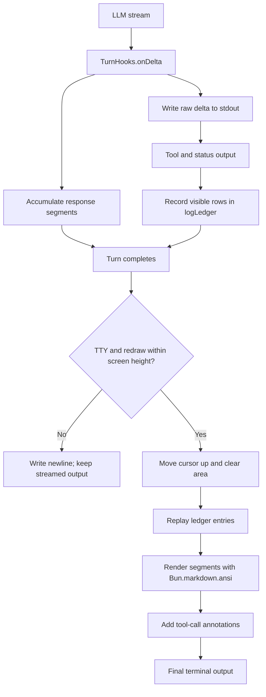

# Agent Cody


A harness to learn about harnesses.

I wanted to know how coding agents actually work. Not the API calls. The loop. The part that decides what to do next, runs a tool, reads the result, and keeps going. So I built one. Agent Cody is a CLI agent in Bun and TypeScript that talks to any OpenAI-compatible API. Every decision is visible in the source. No framework in between you and the mechanism.

## What you get

A `cody>` prompt that can actually do work. It runs tools in a loop, up to 100 iterations per turn, and streams the model's reply as it arrives. Nine tools ship with it: file listing and reading, grep, atomic file edits, shell execution in a Bubblewrap sandbox, goal and state tracking, and web search.

File operations stay inside the workspace. Edits are atomic and schema validated. Every I/O boundary goes through Zod.

When the transcript grows too long, the agent compresses its own history instead of dying. More on that below.

Sessions persist to SQLite, so you can resume work and replay exactly what happened, tool calls included.

## Requirements

- [Bun](https://bun.sh/)
- An API key for an OpenAI-compatible provider

## Installation

```bash
bun install
```

## Configuration

Copy the example file and set your credentials:

```bash
cp .env.example .env
```

| Variable | Required | Description | Default |
| --- | --- | --- | --- |
| `API_KEY` | Yes | API credential for the configured provider | — |
| `BASE_URL` | No | OpenAI-compatible API base URL | `https://api.openai.com/v1` |
| `MODEL` | No | Model name sent to the provider | `gpt-5.6-luna` |
| `REASONING_EFFORT` | No | Reasoning effort supported by the provider | `none` |
| `PARALLEL_API_KEY` | Yes for `search_web` | Parallel web-search API credential | — |
| `COMPACTION_TURN_THRESHOLD` | No | Tool-call rounds between scheduled compaction checks | `25` |

Example:

```dotenv
API_KEY=your-api-key
BASE_URL=https://api.openai.com/v1
MODEL=gpt-5.6-luna
REASONING_EFFORT=none
COMPACTION_TURN_THRESHOLD=25
PARALLEL_API_KEY=your-parallel-api-key
```

`COMPACTION_TURN_THRESHOLD` is injected into the compiled build. The value in `.env.example` is illustrative. The build defaults to `25` when the variable is not set.

## Running

Start the development CLI:

```bash
bun run start
```

Build and run the production executable:

```bash
bun run build
./build/cody
```

Type `exit`, `q`, or `quit` to quit. Press `Ctrl+C` once to scrap the current input and get a fresh prompt. Press it twice in a row to exit.

## Architecture

The project splits into layers with a strict rule. The agent layer builds requests. The transport layer sends them and knows nothing about agents.

```text
main.ts                 Entry point
agent/                  Agent orchestration and tools
  agent.ts              Turn execution and context compaction
  loop.ts               CLI input loop
  loop/                 Loop helpers (rendering, interrupt handling)
  prompt/               System prompt and rubric logic
  stats.ts              Session statistics
  tools/                Built-in tool implementations
llm/                    OpenAI-compatible transport
config/                 Environment and logging configuration
schemas/                Runtime message schemas
build.ts                Production build script
```

Tools carry their own Zod parameter schemas and `execute` functions. `TurnHooks` exposes streaming, tool-call, usage, compaction, and turn-completion events to the CLI.

## Session persistence

Session metadata, messages, tool actions, statistics, task state, available tools, and compaction counts live in `cody_db.sqlite`. The database is created on startup and is the source of truth for replay. Tool messages and action results persist atomically.

Resume a session and the agent restores its transcript and tool definitions. After compaction, replay starts at the latest `compaction_task` boundary and picks up the summary plus everything newer.

Inspect it with SQLite:

```bash
sqlite3 cody_db.sqlite ".tables"
sqlite3 cody_db.sqlite "SELECT session_id, last_updated_at, compaction_count FROM sessions;"
```

Delete `cody_db.sqlite` to wipe local history. It gets recreated on the next run.

## Context compaction

Long sessions outgrow any context window. The strategy here follows [Self-Compact](https://arxiv.org/abs/2510.00609). After a stretch of tool-call rounds, the agent asks the model whether history should be compressed. Past 80% of the 1,050,000-token budget, compaction is forced.

The summary keeps the original task and the live context: goals, steps, notes, decisions, files read. Then it replaces the older transcript so work continues from the current step. Past 90% usage the summary prompt gets shorter. If compaction fails, the existing context stays put. Nothing is lost silently.

## Development

### Scripts

| Script | Description |
| --- | --- |
| `bun run start` | Start the development CLI |
| `bun run build` | Build the compiled executable at `build/cody` |
| `bun run typecheck` | Type-check without emitting files |
| `bun run lint` | Run Biome linting |
| `bun run lint:fix` | Apply Biome lint fixes |
| `bun run format` | Format files with Biome |
| `bun run format:check` | Check formatting without modifying files |
| `bun run check` | Run typecheck, lint, and format checks |

### Adding a tool

1. Create a module under `agent/tools/`.
2. Define a Zod schema for its parameters.
3. Export a `ToolDefinition` with its name, description, label, parameters, and `execute` function.
4. Register the definition in `agent/tools/discover.ts`.
5. Return a validated `contextUpdate` if the tool changes task context.
6. Run `bun run check`.

## Telemetry

Logging uses Pino. Development output goes through `pino-pretty`. Log records carry OpenTelemetry-compatible service, environment, severity, and trace fields where available.

## Terminal rendering

The CLI writes to `stdout` directly. No fullscreen TUI. Each text delta streams immediately for low latency and accumulates into response segments. Tool and status messages share the stream and land in `logLedger` with their visible row counts. ANSI sequences get stripped before measuring, so redraw math uses what the terminal actually shows rather than raw string length.

When a turn ends on a TTY, the CLI measures the streamed response plus ledger height, moves the cursor up, and clears that block. Then it replays the ledger entries, renders each response segment from Markdown with `Bun.markdown.ansi`, and drops a `(tools were called)` marker between segments split by tool activity. The raw stream is replaced by the formatted result. Logs emitted mid-turn survive because the ledger recorded them.

If the block already scrolled past the terminal height, the CLI skips the redraw and prints a newline instead. Piped output is never redrawn, so pipes and redirects stay plain.

### Rendering flow



## License

See [LICENSE](LICENSE) for details.
